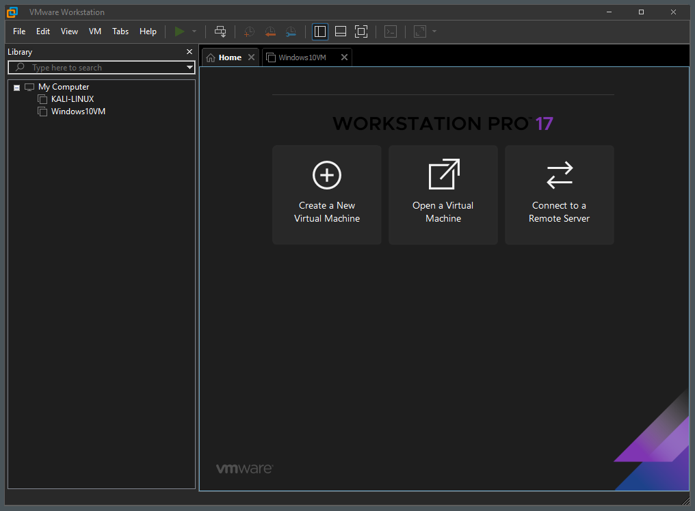
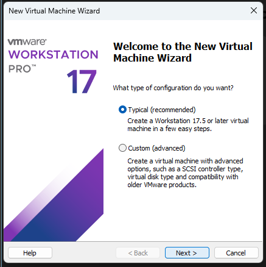
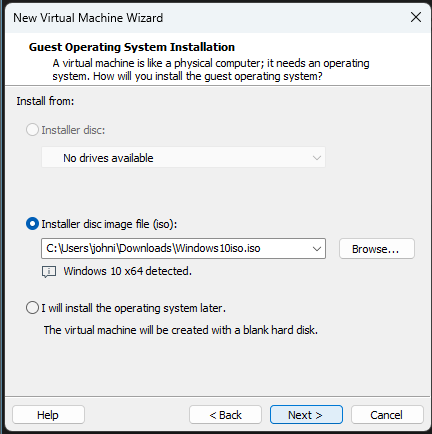

# Installation of VMware 
## Install required tools:

### VMware Workstation Pro
1. Installed WMware Workstation Pro using the link: [Website to download](https://www.vmware.com/products/desktop-hypervisor/workstation-and-fusion)
2. Downloaded both Windows10 and Kali-Linux ISO

   - Windows10 ISO [Download](https://www.microsoft.com/en-us/software-download/windows10m)
   - Kali-Linux ISO [Download](https://www.kali.org/get-kali/#kali-platforms)

## Setting up VM's 
1. After I downloaded Workstation Pro I installed and ran it

2. Next step was to "Create a New Virtual Machine" and Choose "Recommended"

3. I then browsed the ISO files I downloaded from the steps above.

4. Name the Virtual Machine
5. Choose disk space
6. Customize your VM based on how much resource you want and have and done.
7. Power the VM's on.
   - NOTE: The Login/Password for Kali-linux is: "kali"