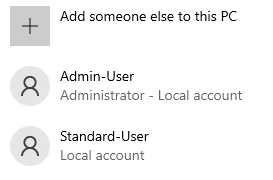
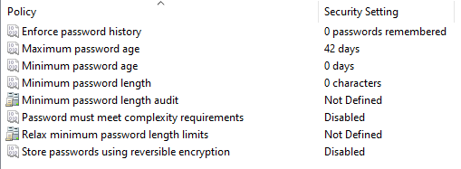
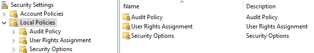
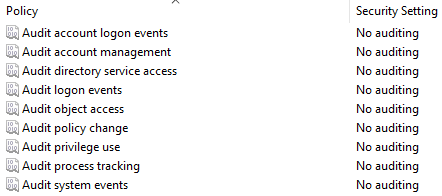
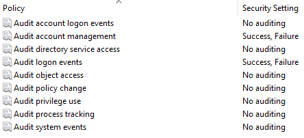
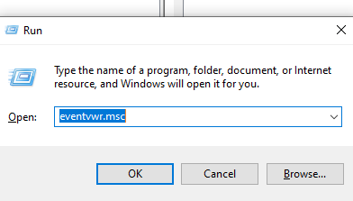
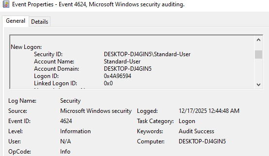
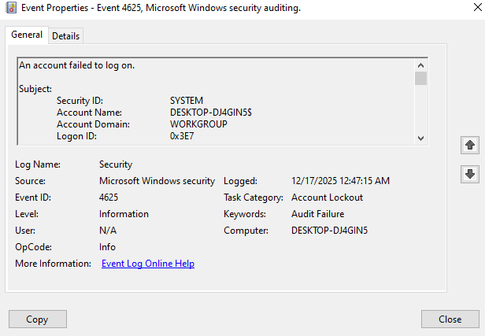

# Windows10 Labs

## Overview:

The objective of these labs is to demonstrate my understanding of Windows 10 through configuring, hardening, and monitoring Windows 10 system as if it were in a corporate setting.
My goal is to build foundational, Cybersecurity-related skills in endpoint security, logging, and basic incident detection.
** As October 14, 2025 Windows10 in no longer receving security updates.

## Objectives:

   - Configure a Windows 10 VM securely
   - Apply baseline security hardening policies
   - Enable and validate security logging
   - Analyze Windows Security Event Logs
   - Document findings clearly for portfolio and interview use

## Lab Environment

   - Host OS: Windows11
   - VM Platform: VMware Workstation
   - Guest OS: Windows10 Pro
   - VM Name: Windows10-Lab
   - Network mode: NAT

## User Accounts Configured

| Username      | Role                | Purpose               |
| ------------- | ------------------- | --------------------- |
| Admin-User    | Local Administrator | System administration |
| Standard-User | Standard User       | Simulated end user    |

## Security Configuration Performed

1. Windows Updates
   - Verified Windows was fully patched (Windows10 EOL support)
   - Turn on automatic updates

 

2. Microsoft Defender Antivirus
   - Real-time protection enabled
   - Cloud-delivered protection enabled
   - Automatic sample submission enabled

3. Windows Defender Firewall
   - Firewall enabled on all profiles (Domain, Private, and Public)
   - Inbound connections blocked by default
   - Outbound connections allowed by default

## Local Security Policy Hardening 

I opened the windows run command using Win + R, then typed; secpol.msc this will open up the local security policy

### Password Policy 

Go to Account Policies (left sidebar) then click Password Policy. Here I will set the settings to what I believe is recommended.
   - Enabled Password must meet complexity requirements.
   - Minimum password length: 12
   - Maximum password age: 60-90 days

 

### Account Lockout Policy

Go to Account Policies and then click Account Lockout Policy
   - Account lockout threshold: 10 invalid attempts
   - Account lockout duration: 15 minutes
   - Reset account lockout counter after: 15 minutes

 

## Enable Auditing for Logon and Account Management

Using secpol.msc in Windows command run, go to Local Policies and then Audit Policy.

Next, configuring policies to whats recommended:
   - Audit logon events: Success, Failure
   - Audit account management: Success, Failure
   - (Optional) Audit policy change: Success, Failure

 

## Generate Test Events (Logs)

We're going to create event logs to look at. First I'm going to sign out and login into my Standard-user. I set a password after configuring the password policy.
After I logged out and attempted to login using wrong passwords to generate event logs to look at.

1. Successful Login (Event ID: 4624)

2. Failed Logons (Event ID: 4625)

3. Account Lockout (Event ID: 4740)

## Investigate in Event Viewer 

Open "Event Viewer" by typing the name in the search bar or by using run command and using: eventvwr.msc

1. Go to Windows Logs, then Security

2. On the right, click Filter Current Log...

3. In Event IDs, enter: 4624, 4625, 4740

4. Click OK

5. Click each event and capture:
   - Timestamp
   - Account name
   - Workstation name/source
   - Failure reason for 4625

