# Windows 10 Sysmon-Lab

## Objective

The Objective of this lab is to familiarize myself with enhancing endpoint visibility on a Windows 10 system by deploying and configuring system monitoring to capture detailed host-based telemetry.

   - Process creation
   - Network connections
   - File creation
   - Command-line execution

## Download Sysmon (Official Microsoft Tool)

1. Open a browser in the Windows 10 VM
2. Search: Sysmon Sysinternals

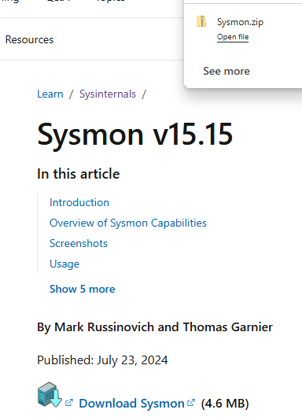

3. Download Sysmon.zip
4. Extract the ZIP

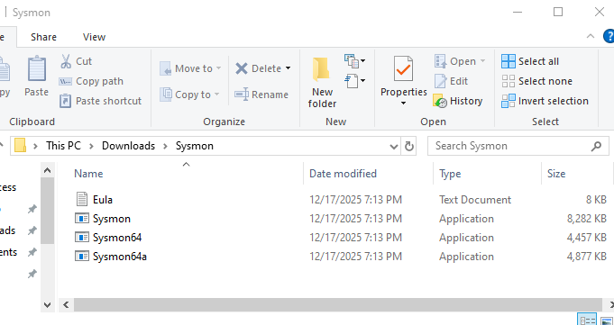

## Download a Sysmon Configuration File

I was recommended to download: SwiftOnSecurity Sysmon Config, because without it Sysmon is useless without one.

1. Search on Github for SwiftOnSecurity sysmon-config

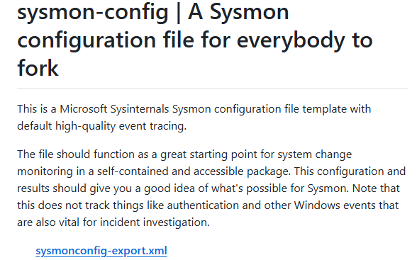

2. Open the repository
3. Copy the sysmonconfig-export.xml file
4. Save it to your sysmon folder:

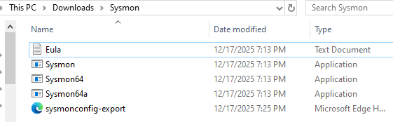

## Installing Sysmon with configuration

1. Open Command Prompt as Admin
2. Navigate to the Sysmon directory: use the "cd" to change directory and then the path your folder is in.
   - cd C:\Sysmon

3. Install Sysmon:
   - Sysmon64.exe -accepteula -i sysmonconfig-export.xml

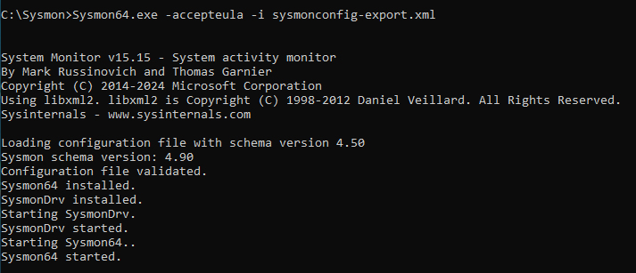

4. Open Servies (services.msc) in Run
5. Confirm Sysmon64 is:
   - Running
   - Automatic

## Confirm Sysmon is Logging Events

1. Open Event Viewer
2. Navigate to:
Applications and Services Logs
→ Microsoft
→ Windows
→ Sysmon
→ Operational

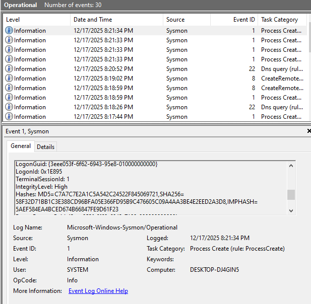

## Generate Controlled Activity (So logs mean something)

### Process Creation (Event ID 1)

    1. Open Command Prompt
    2. Run
       - notepad.exe
       - calc.exe
    3. Close both programs

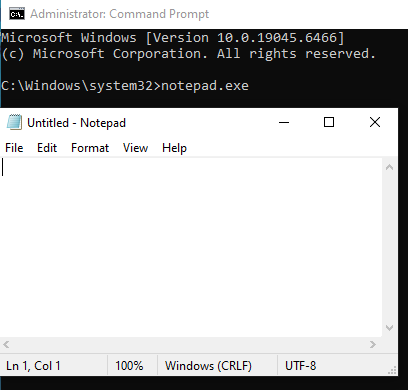 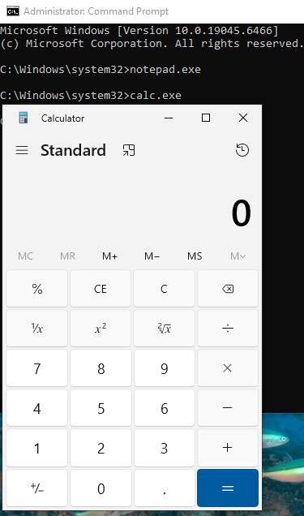

### Command-line Execution

    1. In Command prompt, run:
       -ipconfig /all
       -whoami
       -tasklist

(ipconfig /all):
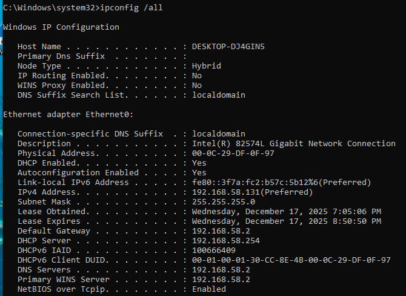

(whoami):

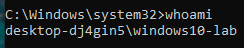

(tasklist):

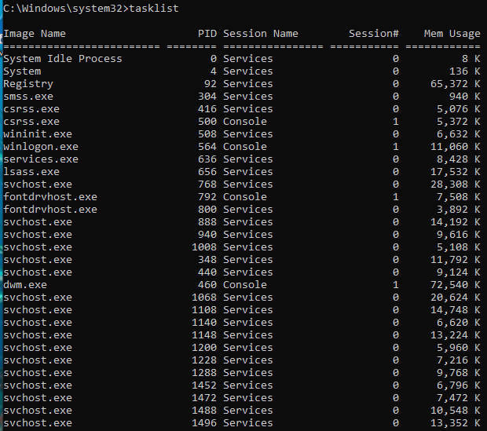

### Network Connection (Event ID 3)

1. Open browser
2. Visit any website: I used "Google.com"

### File Creation (Event ID 11)

1. Create a text file on the Desktop
2. Name it: sysmon-test.txt
3. Add text and save

### Analyze Sysmon Logs (SOC SKILL)

1. In Sysmon go-to Operational
2. CLick "Filter Current Log"
3. Enter Event IDs:
    1,3,11
4. Click "OK"

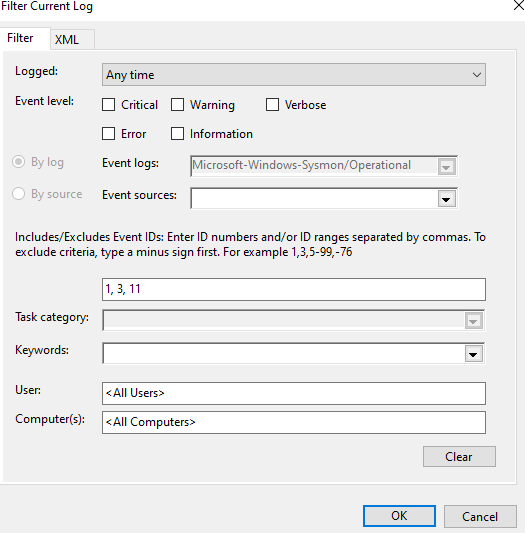

#### What to Inspect for Each Event

Click an event and document:
   - Image (process name)
   - Commandline
   - ParentImage
   - User
   - DestinationIp (for EventID 3)

#### Full Detail Panel for Event 1:

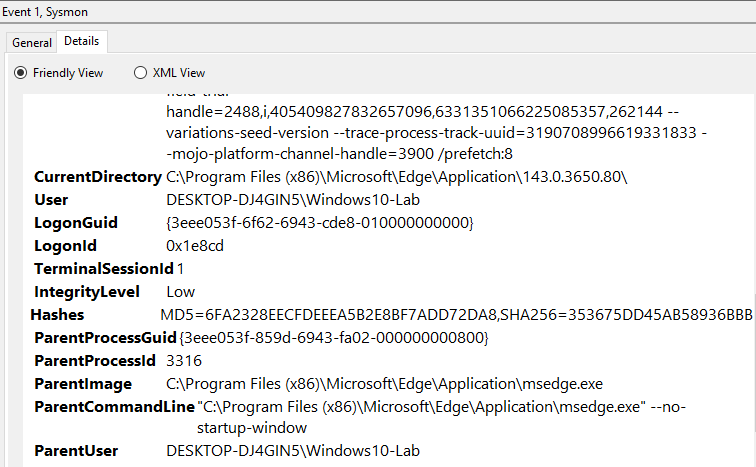

Documentation:

#### Full Detail Panel for Event 3:

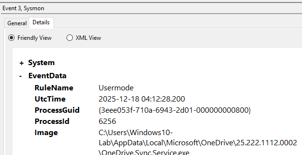

Documentation:

- No command-line because Event 3 is a Network Connection
- No parent-image because Event 3 is a Network Connection

#### Full Detail Panel for Event 

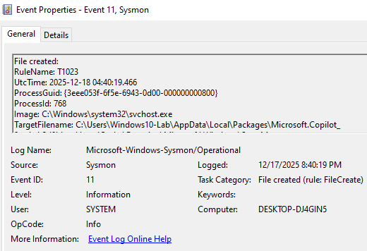

Documentation:

- No command-line because Event 11 is a File Creation
- No parent-image because Event 11 is a File Creation

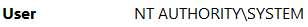

## Enhancement (Optional)

Install Autoruns or Process Explorer (Sysinternals tools) and mention how Sysmon complements them.

Answer: 

## Compare Native Logs vs Sysmon (Critical Thinking)

Answer these in your README:

   - What does Sysmon caputre that Event Viewer does not?
   - Why is command-line logging important?
   - How would attackesr abuse PowerShell or cmd?

Note: Strong interview questions.