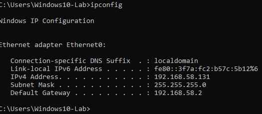
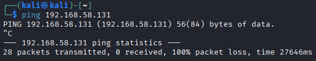
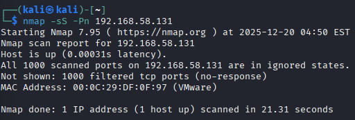

# Windows10/Kali-Linux Vulnerability Scanning

## Objective 

The objective of this lab is to identify, analyze, and document securit vulnerabilities on a Windows 10 endpoint using authenticated and unauthenticated scanning techniques, then assess risk and remediation impact from a defensive (SOC) perspective.

## Part:A - Network Reconnaissance (Baseline)

#### 1. I need to identify Windows 10 IP Address
   - On Windows 10:
      1. Open Command Prompt
      2. Run: "ipconfig"

         

      3. The IPv4 Address is 192.168.58.131. Which was successful

#### 2. Confirm Connectivity from Kali 
   - On Kali-Linux
      1. Open Terminal
      2. Ping Windows VM: "ping insert IP address"
      3. This is the successful ping response

          

## Part:B - Port and Service Discovery (Nmap)

#### 3. Run a basic TCP scan
   - On Kali-Linux:
   1. Open Terminal
   2. Run: "nmap -sS -Pn insert IP address"

   The purpose:
   - Identify exposed services
   - Establish attack surface

   Results:

   

   ** This was not the result I wanted I will go back to see where I messed up. (likely because of the hardening I did on Lab-01)

   1. I tried to use a SYN scan with privileges to bypass the firewall behaviors and did not work:
      - (sudo nmap -sS Pn insert IP address).

#### I'm going to Temporarily open a Port for Validation
(For Lab purposes only)

#### On Windows 10
   1. Open "Run" and type: "wf.msc"
   2. In Inbound Rules
   3. Create New RUle
      - Type: Port
      - TCP
      - Specific port: 3389 (RDP) or 80
      - Allow the connection

   4. Name it: LAB-TEST-OPEN-PORT

    Re-run 

   

#### 4. Run Vulnerability Detection Scripts
   - On Kali-Linux
   1. Open Terminal
   2. Run: "nmap --script vuln insert IP address"

   The purpose:
   - Identify common misconfigurations
   - Detect known vulnerabilites

   Results:

   