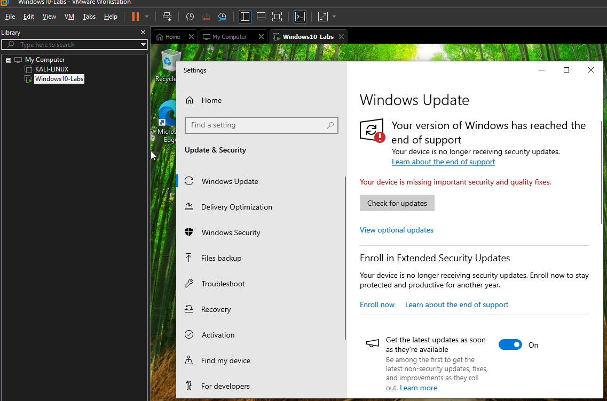
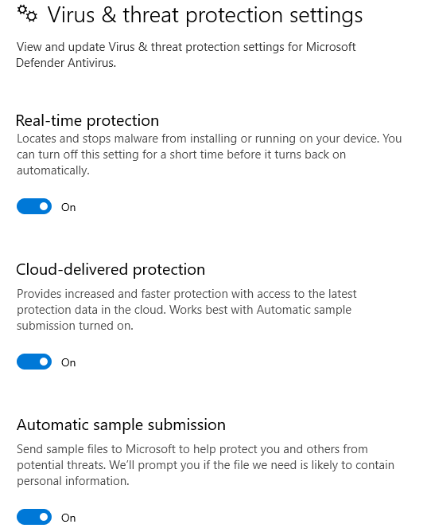

# Windows10 Labs

## Overview:

The objective of these labs is to demonstrate my understanding of Windows 10 through configuring, hardening, and monitoring Windows 10 system as if it were in a corporate setting.
My goal is to build foundational, Cybersecurity-related skills in endpoint security, logging, and basic incident detection.
** As October 14, 2025 Windows10 in no longer receving security updates.

## Objectives:

   - Configure a Windows 10 VM securely
   - Apply baseline security hardening policies
   - Enable and validate security logging
   - Analyze Windows Security Event Logs
   - Document findings clearly for portfolio and interview use

## Lab Environment

   - Host OS: Windows11
   - VM Platform: VMware Workstation
   - Guest OS: Windows10 Pro
   - VM Name: Windows10-Lab
   - Network mode: NAT

## User Accounts Configured

| Username      | Role                | Purpose               |
| ------------- | ------------------- | --------------------- |
| Admin-User    | Local Administrator | System administration |
| Standard-User | Standard User       | Simulated end user    |

## Security Configuration Performed
1. Windows Updates
   - Verified Windows was fully patched (Windows10 EOL support)
   - Turn on automatic updates

 

2. Microsoft Defender Antivirus
   - Real-time protection enabled
   - Cloud-delivered protection enabled
   - Automatic sample submission enabled

3. Windows Defender Firewall
   - Firewall enabled on all profiles (Domain, Private, and Public)
   - Inbound connections blocked by default
   - Outbound connections allowed by default

## Local Security Policy Hardening 
